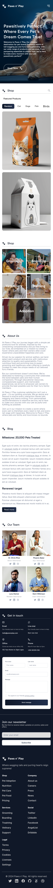

# Paws n' Play Responsive

Compass UOL - FullStack Internship Project

## Objective

This project involves the implementation of a responsive blog homepage, adhering to web development best practices. The goal is to create a functional and visually appealing interface, focusing on responsiveness.

## Technologies Used

- **HTML5**
- **CSS3**
- **JavaScript**

## Features

- **Responsiveness**: Optimized for devices of all screen sizes, following the **Mobile First** approach.
- **Dynamic Homepage**: Functional menus and interactive elements.
- **Validated Forms**: Responsive forms with data validation.
- **Hover Effects**: Visual effects triggered when hovering over products, revealing additional information, based on the design.

## Project Requirements

1. Develop the **Homepage** of a blog based on the provided design.
2. The page must closely match the provided designs, including:
   - **Featured Products** section with hover effects.
   - **Get in Touch** section with a validated form.
   - **Newsletter** area with validation functionality.
3. Secondary page navigation does not need to be implemented.
4. In the **Featured Products** section, the search field will be purely visual (non-functional).

### Restrictions
- The use of libraries or frameworks, such as React.js or Node.js, is not allowed.
- The implementation should focus on native technologies (**HTML**, **CSS**, **JS/TS**) and follow programming best practices.

## Development Methodology

The development followed an organized and **Semantically** focused approach, starting with the creation of the HTML document. The priority was to ensure that the information was structured in a logical and accessible manner.

After the HTML was completed, attention shifted to the CSS, beginning with the resets and definition of the main containers to establish the foundation. Style rules were then developed in the order of element appearance, using **Nesting** to enhance the code readability and organization.

The **Mobile First** approach was adopted, ensuring that the design was initially optimized for mobile devices, with subsequent adaptations for larger screens. This strategy guarantees a responsive and consistent user experience across various devices.

Practices such as importing fonts from Google Fonts and setting maximum heights for images were implemented to strengthen the visual consistency of the project.

### Design References

  

    <h4>Mobile Layout</h4>
    
  

  

    <h4>Desktop Layout</h4>
    
  

